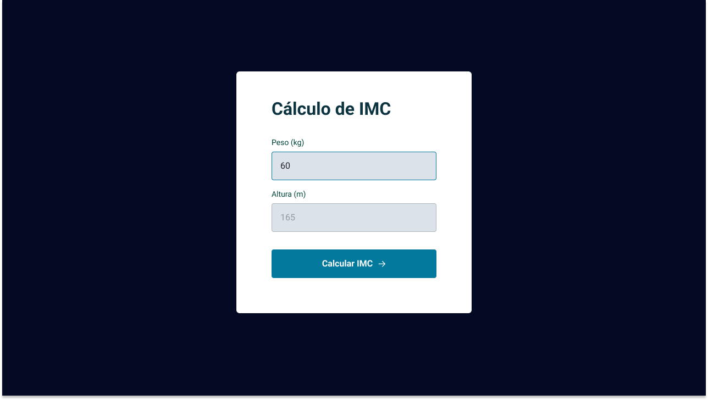

<h1 align="center"> IMC </h1>

Projeto exclusivo e gratuito, promovido pela Rocketseat para ensino de tecnologias WEB, durante o curso EXPLORE.  

  <a href="#-tecnologias">Tecnologias</a>&nbsp;&nbsp;&nbsp;|&nbsp;&nbsp;&nbsp;
  <a href="#-projeto">Projeto</a>&nbsp;&nbsp;&nbsp;|&nbsp;&nbsp;&nbsp;
  <a href="#-layout">Layout</a>&nbsp;&nbsp;&nbsp;|&nbsp;&nbsp;&nbsp;
  <a href="#memo-licença">Licença</a>

  

 

  

## 🚀 Tecnologias

Esse projeto foi desenvolvido com as seguintes tecnologias:

- HTML e CSS
- JavaScript
- Git e Github
- Figma

## 💻 Projeto

Imc é um projeto desenvolvido para calcular o IMC dos usuários utilizando seu peso e altura.
Projeto também utilizado para aprimoramento do conceito de modularização.

## 🔖 Layout

Você pode visualizar o layout do projeto através [DESSE LINK](https://www.figma.com/file/co1XQWRvtytPUZxEnMrGbt/IMC-(Copy)?type=design&node-id=6%3A5&mode=design&t=ERuIEovOTvGSzkRO-1). É necessário ter conta no [Figma](https://figma.com) para acessá-lo.

## :memo: Licença

Esse projeto está sob a licença MIT.

---
